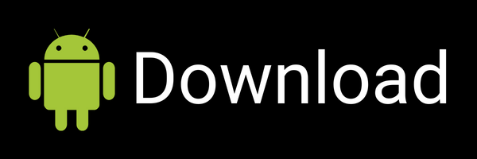
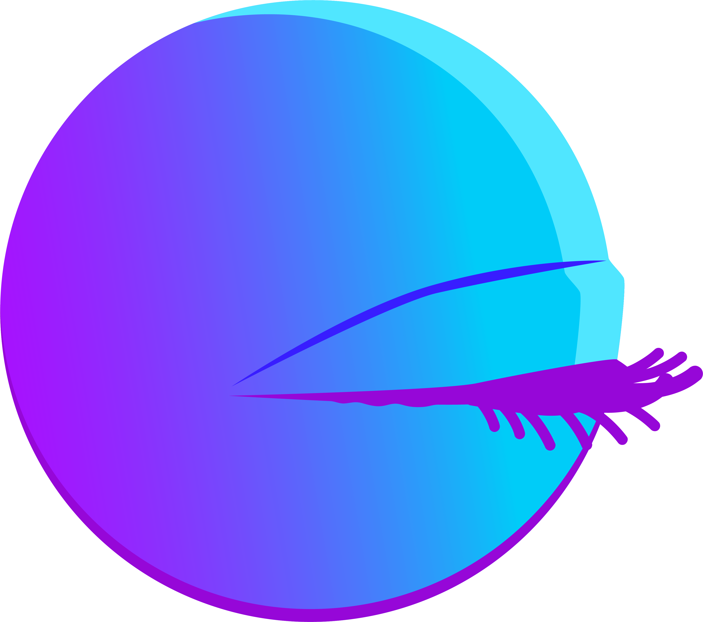

# Android Download (Version 3.1)

- Requires Android 8.0 (API level 26) or higher.
- Navigate to the **Install unknown apps** system settings screen to enable app installation from your source e.g. your Browser.

[Source Code](https://github.com/isaakhanimann/psychonautwiki-journal-android)

# iOS Download

**To unlock all substances go to Settings, find the closed eye and triple tap it quickly.**

## Android App Images

